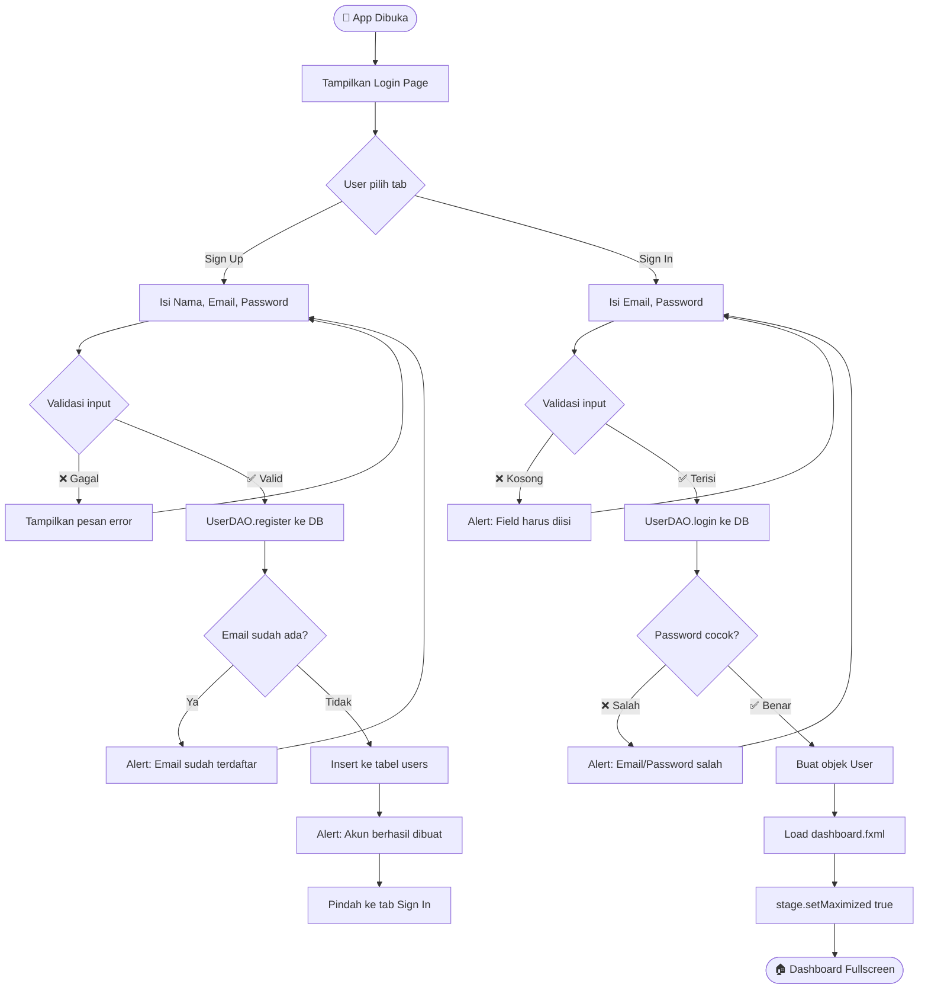
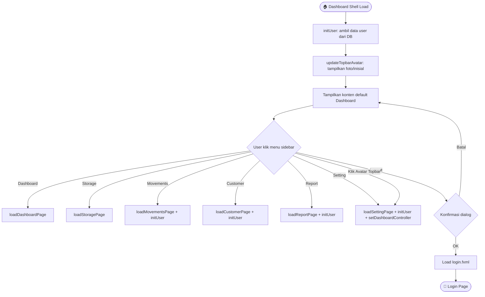
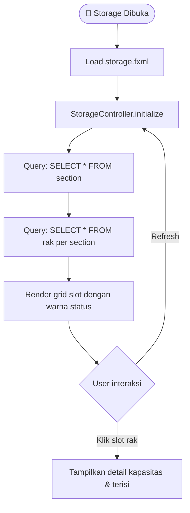
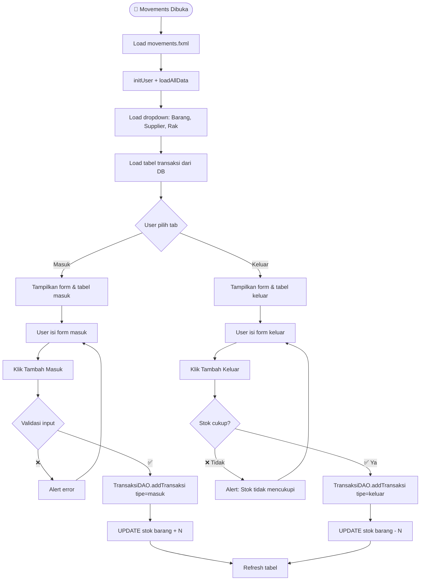
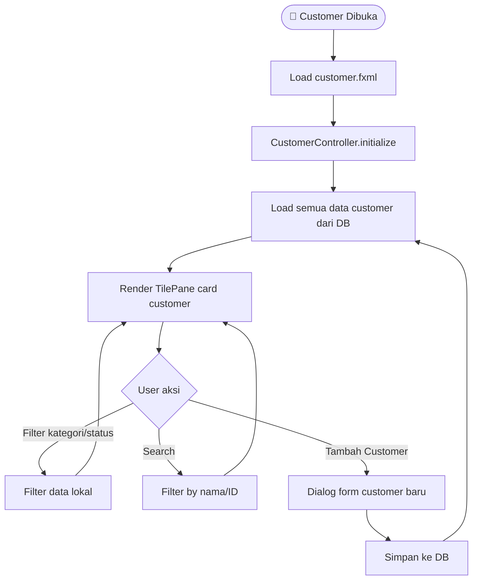
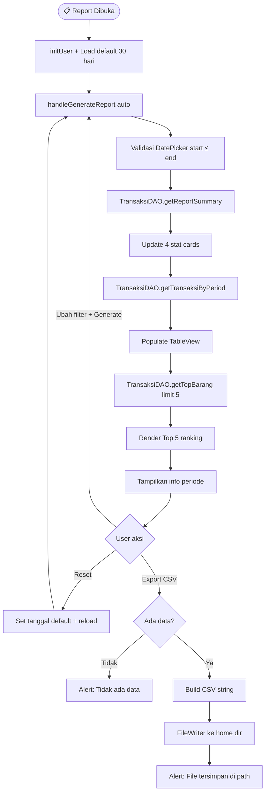
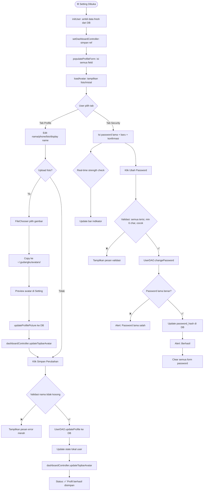
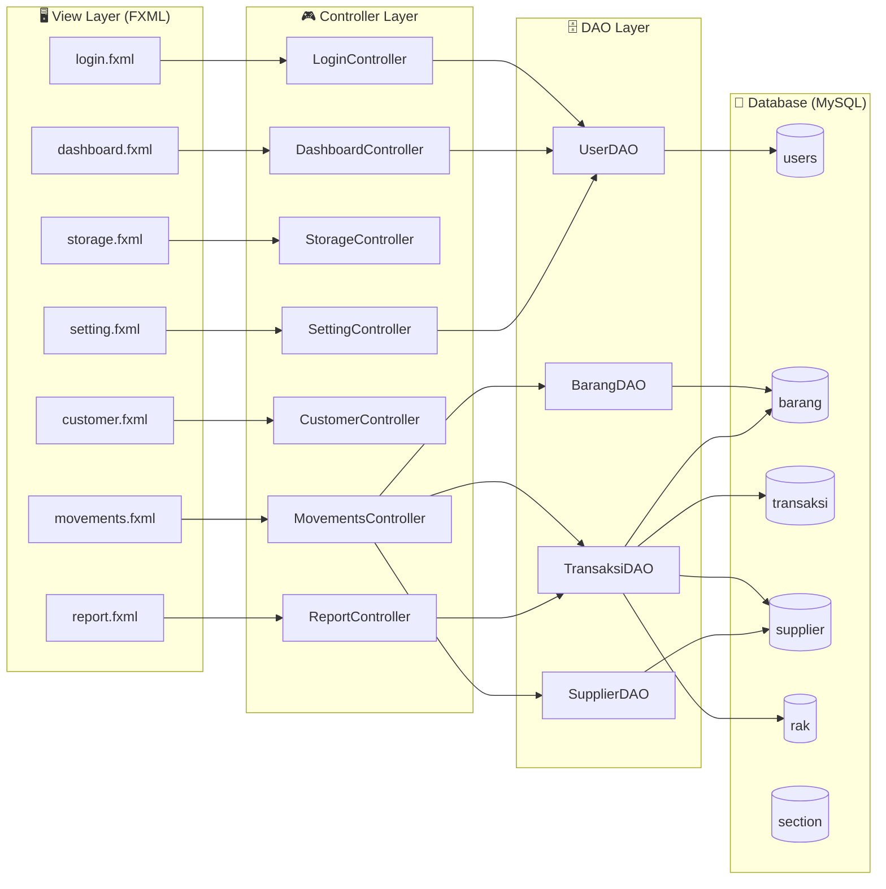

# 📦 GudangKu — Dokumentasi Aplikasi

> **GudangKu** adalah aplikasi desktop manajemen gudang berbasis JavaFX.  
> Teknologi: Java 17 + JavaFX 21 + MySQL 8

---

## 🗂 Daftar Halaman

| Halaman | File FXML | Controller |
|---------|-----------|------------|
| [Login](#1-login) | `login.fxml` | `LoginController.java` |
| [Dashboard](#2-dashboard) | `dashboard.fxml` | `DashboardController.java` |
| [Storage](#3-storage) | `storage.fxml` | `StorageController.java` |
| [Movements](#4-movements) | `movements.fxml` | `MovementsController.java` |
| [Customer](#5-customer) | `customer.fxml` | `CustomerController.java` |
| [Report](#6-report) | `report.fxml` | `ReportController.java` |
| [Setting](#7-setting) | `setting.fxml` | `SettingController.java` |

---

## 1. Login

### Deskripsi
Halaman awal aplikasi untuk autentikasi pengguna. Terdiri dari dua tab: **Sign Up** (registrasi akun baru) dan **Sign In** (masuk ke aplikasi).

### Fitur
- **Tab Sign Up** — registrasi dengan nama lengkap, email, dan password (min. 6 karakter)
- **Tab Sign In** — login dengan email + password, validasi dari database
- **Lupa Password** — placeholder untuk fitur reset password
- Transisi ke Dashboard setelah login berhasil (**fullscreen otomatis**)

### Flowchart



---

## 2. Dashboard

### Deskripsi
Halaman utama yang menjadi **shell/wrapper** seluruh aplikasi. Terdiri dari **Sidebar navigasi** (kiri), **Topbar** (atas), dan **ScrollPane konten** (tengah) yang diisi secara dinamis sesuai menu yang diklik.

### Komponen Topbar
- Judul halaman aktif
- Search box
- Tombol notifikasi 🔔
- **Avatar bulat** — menampilkan foto profil atau inisial nama, klik untuk ke Setting

### Komponen Sidebar
| Menu | Icon | Keterangan |
|------|------|------------|
| Dashboard | ⊞ | Halaman ringkasan |
| Storage | 🗄 | Manajemen rak & section |
| Movements | 🚚 | Transaksi masuk/keluar |
| Customer | 👤 | Data pelanggan |
| Report | 📋 | Laporan periode |
| Setting | ⚙ | Profil & keamanan |
| Logout | ⏻ | Keluar aplikasi |

### Konten Default (Dashboard)
- **Section Overview** — Grid slot rak Section A, B, C dengan warna status
- **Recent Activity** — Barang masuk & keluar 24 jam terakhir
- **Recent Transaction** — 5 transaksi terbaru
- **Top Movers** — 3 barang paling aktif
- **Storage Alert** — Rak yang mendekati/mencapai kapasitas

### Flowchart



---

## 3. Storage

### Deskripsi
Halaman manajemen lokasi fisik gudang: **Section** dan **Rak**. Menampilkan peta visual slot rak beserta status pengisian.

### Fitur
- Tampilan grid slot rak per section (A, B, C)
- Kode warna status:
  - 🔵 Biru — Normal (tersedia)
  - 🟢 Hijau — Terisi
  - 🔴 Merah — Penuh/kritis
- Informasi kapasitas & persentase pengisian
- Data real dari tabel `rak` dan `section`

### Flowchart



---

## 4. Movements

### Deskripsi
Halaman pencatatan **transaksi pergerakan barang** — masuk dan keluar gudang. Menggunakan tab untuk memisahkan view **Barang Masuk** dan **Barang Keluar**.

### Fitur
- **Tab Masuk** — form tambah transaksi masuk + tabel riwayat masuk
- **Tab Keluar** — form tambah transaksi keluar + tabel riwayat keluar
- Field form: Barang, Supplier, Rak, Jumlah, Keterangan
- Auto-generate kode transaksi (TRX-00001, TRX-00002, ...)
- Update stok barang otomatis setelah transaksi
- Validasi stok tidak boleh negatif saat keluar

### Flowchart



---

## 5. Customer

### Deskripsi
Halaman manajemen data pelanggan/supplier yang berhubungan dengan gudang.

### Fitur
- Grid card pelanggan dengan informasi: nama, kontak, email, alamat
- Filter berdasarkan kategori dan status
- Search berdasarkan nama, ID, atau perusahaan
- Tambah pelanggan baru

### Flowchart



---

## 6. Report

### Deskripsi
Halaman laporan pergerakan barang berdasarkan **filter periode waktu** dan **tipe transaksi**. Menyediakan ringkasan statistik, tabel detail, dan ranking barang paling aktif.

### Fitur
- **Filter bar** — DatePicker dari/sampai + ComboBox tipe (Semua/Masuk/Keluar)
- Default periode: 30 hari terakhir
- **4 Summary Cards** — Total Transaksi, Total Masuk (qty), Total Keluar (qty), Barang Aktif
- **Tabel Laporan** — 8 kolom, warna tipe (🟢 Masuk / 🔴 Keluar), maks. 500 baris
- **Top 5 Barang Aktif** — ranking 🥇🥈🥉 berdasarkan qty bergerak
- **Export CSV** — simpan ke `~/laporan_gudang_YYYY-MM-DD.csv`

### Flowchart



---

## 7. Setting

### Deskripsi
Halaman manajemen akun pengguna. Terdiri dari **dua tab**: **Profile** untuk edit data pribadi & foto, dan **Security** untuk ganti password.

### Tab Profile
- **Avatar bulat** — gradient biru dengan inisial, atau foto yang diupload
- Upload foto: FileChooser → copy ke `~/.gudangku/avatars/user_{id}.ext`
- Hapus foto → kembali ke avatar inisial
- Edit: Full Name (**), Display Name, Phone, Bio
- Email ditampilkan read-only (identifier login, tidak bisa diubah)
- Setelah simpan → **topbar avatar otomatis terupdate**

### Tab Security
- Ganti password dengan verifikasi password lama
- **Password strength indicator** — 4 bar visual (🔴 Lemah → 🟡 Sedang → 🟢 Kuat → 🟢 Sangat Kuat)
- Real-time konfirmasi kecocokan password
- Tips keamanan password
- Danger Zone: Logout semua perangkat

### Database (migration_v3.sql)
```sql
ALTER TABLE users ADD display_name VARCHAR(100)
ALTER TABLE users ADD phone VARCHAR(20)
ALTER TABLE users ADD bio TEXT
ALTER TABLE users ADD profile_picture_path VARCHAR(500)
```

### Flowchart



---

## 🏗 Arsitektur Sistem



---

## 🚀 Cara Menjalankan

```powershell
# 1. Pastikan MySQL Laragon berjalan
# 2. Import schema: src/main/resources/sql/schema.sql
# 3. Import migration: src/main/resources/sql/migration_v3.sql

# Jalankan aplikasi
$env:JAVA_HOME = "C:\Program Files\Java\jdk-17"
.\mvnw.cmd javafx:run
```

### Akun Test Default
| Email | Password | Role |
|-------|----------|------|
| `testuser@example.com` | `Testing123` | user |

---

## 📁 Struktur File Penting

```
src/
├── main/
│   ├── java/com/mycompany/tugas_akhir/
│   │   ├── App.java                  ← Entry point
│   │   ├── DashboardController.java  ← Shell utama + routing
│   │   ├── LoginController.java
│   │   ├── StorageController.java
│   │   ├── MovementsController.java
│   │   ├── CustomerController.java
│   │   ├── ReportController.java
│   │   ├── SettingController.java
│   │   ├── UserDAO.java              ← Auth + profil user
│   │   ├── BarangDAO.java
│   │   ├── TransaksiDAO.java         ← Movements + Report queries
│   │   ├── DatabaseConnection.java   ← Singleton DB connection
│   │   └── PasswordHelper.java
│   └── resources/
│       ├── fxml/                     ← Semua layout halaman
│       ├── css/dashboard.css         ← Global styling
│       └── sql/
│           ├── schema.sql            ← Schema awal
│           ├── migration_v2.sql      ← Tambah stok_max
│           └── migration_v3.sql      ← Tambah kolom profil user
```
